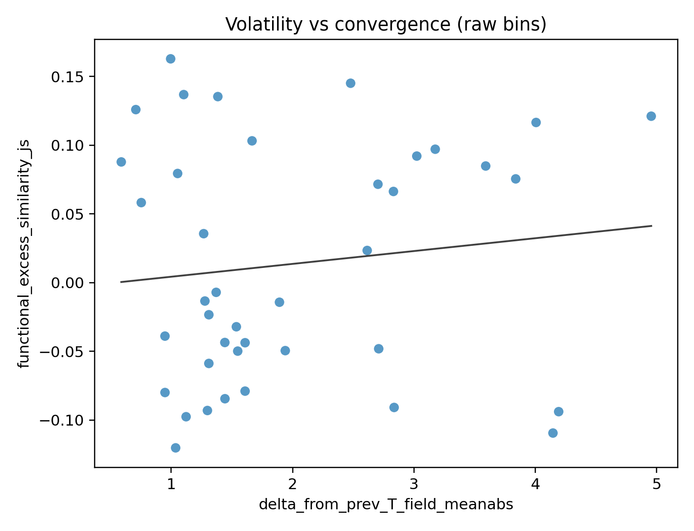
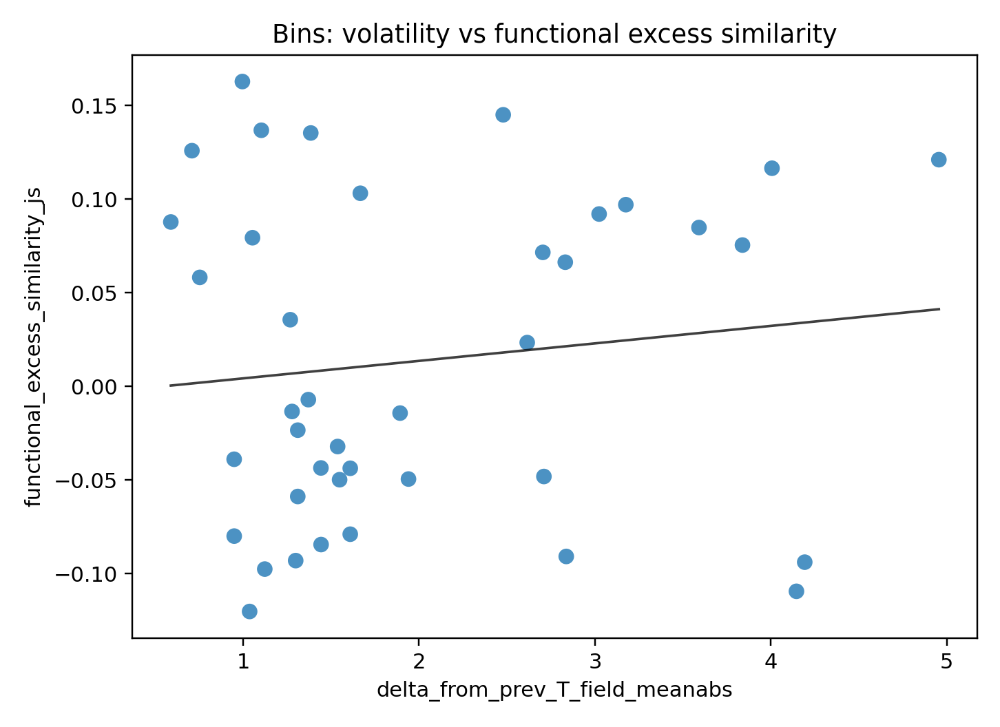
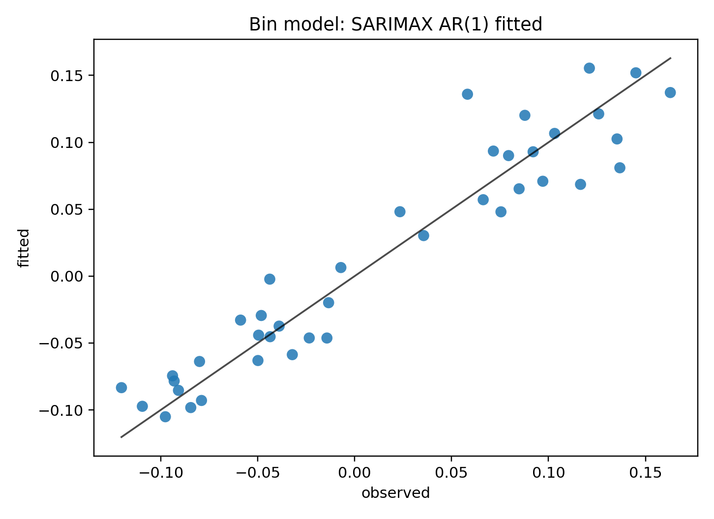

# Research workspace

## Contents

- `writeups/`: draft writeups and research notes.
- `archive/`: older/superseded material kept for context (e.g., the initial paleovelocity pilot).
- `literature/`: reproducible bibliography build + annotated review notes.
- `paleobiotic_velocity/`: the rigorous pipeline (bias controls + survival models + robustness tests) and its outputs.
- `geographic_portfolio/`: event-based survivorship analysis testing range configuration (“connectedness/portfolio”) across mass extinctions + manuscript draft.
- `convergence/`: marine functional convergence across provinces using PBDB ecospace roles.
- `earth_system/`: independent CESM-derived forcing series (Li et al. 2022) + derived coherence/patchiness metrics.
- `pbdb/`: PBDB download + local parquet build helpers (data under `data/` is gitignored).
- `macrostrat/`: rock-record proxy ingestion and binned time series.
- `synthesis/`: end-to-end robustness, pair-level model, interpretability, and publication-grade inference checks.
- `manuscript_convergence_volatility/`: draft paper + supplement focused on volatility → marine functional convergence.
- `figures/`: a small, curated set of figures suitable for embedding in READMEs/writeups.

## Tracked vs generated

- Tracked: writeups (`*.md`), analysis code (`*.py`), curated figures (`figures/`), and selected open-access PDFs (`literature/pdfs/`).
- Not tracked: large intermediate artifacts (raw tables, caches) produced under `output*/`, plus large literature query exports (regeneratable).

## Reproduce key results

Prereq: you need the processed PBDB dataset locally (this repo does not track large datasets under `data/`).

Once `data/processed/merged_occurrences.parquet` exists, run the “one button” pipeline:

`python thesis/run_all.py`

## Reading order

- Best-supported result: `thesis/synthesis/FINAL_REPORT.md`
- High-level overview: `thesis/writeups/research_summary.md`

## Highlights

### Marine functional convergence vs climate volatility

### Pair-level model (publication-oriented)

### Bin-level time-series model fit

